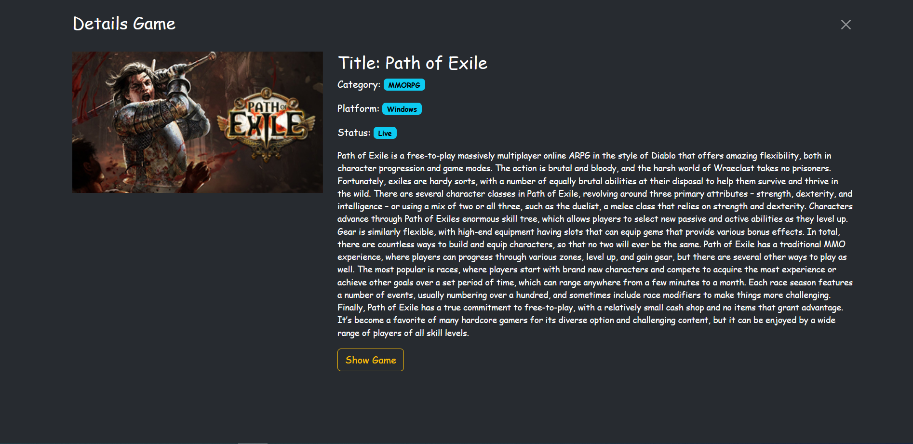

# Game Explorer App

This project is a web application for exploring free-to-play games, fetching data from the **Free-to-Play Games Database API**, and displaying it using a responsive design. The app utilizes JavaScript with an object-oriented programming (OOP) approach to ensure maintainable and scalable code.

---

## Features

- **Browse Games by Category**: Users can select different categories to fetch and display games.
- **Game Details View**: Clicking on a game displays detailed information, including title, genre, platform, and description.
- **Responsive Design**: The app is fully responsive and works well on various devices.
- **Organized Code Structure**: Code is divided into three main files for better maintainability:
  1. `api.js`: Manages API interactions.
  2. `ui.js`: Handles user interface updates.
  3. `app.js`: Orchestrates the logic and connects API and UI.

---

## Project Structure

```plaintext
project-directory/
|-- assets/
|   |-- api.js          # Handles API requests
|   |-- ui.js           # Manages UI updates
|-- app.js              # Main application logic
|-- index.html          # HTML structure
|-- styles.css          # Custom styles (if any)
```

---

## How It Works

### 1. API Integration
The app fetches data from the **Free-to-Play Games Database API** using `fetch` requests. The `api.js` file includes methods for:
- Fetching games by category.
- Fetching detailed information for a specific game.


### 2. User Interface (UI)
The `ui.js` file defines methods to:
- Display a list of games in cards format.
- Render detailed information about a selected game.
- Manage UI interactions like showing and hiding sections.


### 3. Main Logic
The `app.js` file coordinates the API and UI:
- Loads games by default when the page is opened.
- Listens for category selection to fetch and display games.
- Handles game card clicks to fetch and display game details.

---

## Video Demo



Watch the video demonstration here:
[Demo Video Link](https://youtu.be/7Rj1XLOfNbE) <!-- Replace with actual link -->

---

## Technologies Used

- **HTML**: For structuring the app.
- **CSS**: For styling the app.
- **JavaScript (ES6)**: For dynamic behavior and OOP.
- **Bootstrap**: For responsive design.

---

## Future Enhancements

- Add search functionality for games.
- Include user authentication for saving favorite games.
- Improve UI animations and transitions.


